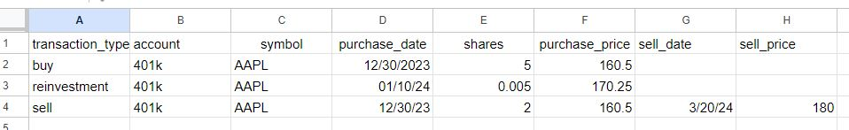
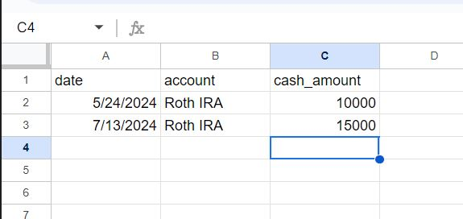
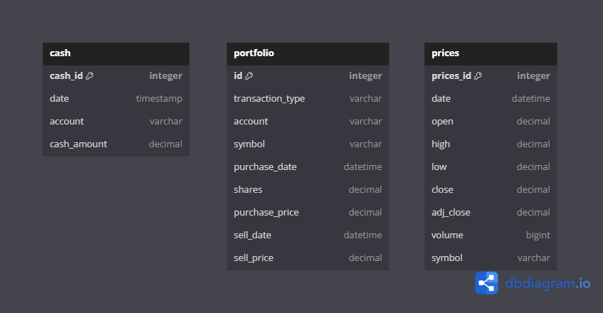
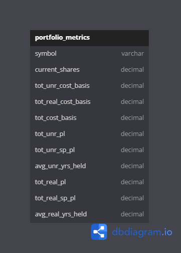

# Investment Portfolio ETL Pipeline 
This project aims to provide a workflow for extracting investment portfolio data stored in Google Sheets, as well 
as financial data through Yahoo Finance, to transform and load into a SQL database for analysis with a BI tool 
such as Power BI.

My most recent portfolio report can be found in `portfolio_report.pdf`.

## Initial Requirements
The following are needed in order to get setup and properly run this project
* MySQL
* Python >= Verion 3
  * IDE of choice
* Google Account
* Google Sheet with two tabs containing portfolio data
  * One tab named 'Transactions' containing portfolio transaction history
  
  
  Currently, there are three options for transaction types (buy, sell, reinvestment), where reinvestment is an 
  automatic reinvestment of dividends into the holding it is paid out from.

  * One tab named 'Cash' for historical cash values in investment accounts
  

### Operating System
This project and directions are tailored towards a Linux operating system. It can be adjusted for windows or 
used through Windows Subsystem Linux.

## Data Sources
There are two data sources that are required for extraction of the information needed.
* Google Sheet (Extracted through API)
  * History of trades, holdings, and cash levels
* Yahoo Finance (Extracted through API)
  * S&P 500 historical prices
  * Historical prices for current portfolio holdings from purchase date

A Google Account and Project must be created. [Here](https://developers.google.com/sheets/api/quickstart/python) is a link to 
Google's documentation for a Python quickstart with their Google Sheets API.

## Initial Setup

* Database
* Python Virtual Environment
* Config File
* Orchestration
* Portfolio Metrics View
* BI Tool

### Database
Once MySQL Server is downloaded and a user profile is made, a database needs to be created. This can be done from the terminal 
by executing the following steps.

**Access MySQL from terminal (replace 'root' with your username)**
``` bash
sudo mysql -u root -p
```
Enter your sudo Linux password, followed by your database user (root) password.

**Create database for fund holdings**
``` sql
CREATE DATABASE portfolio_dwh;
```

### Python Virtual Environment
A python virtual environment through the venv module is used for managing packages and dependencies.
One can be created with the name `etl_env` from the terminal by navigating to the main project directory 
and executing the command below.

**Make pipeline.sh executable**
``` bash
python3 -m venv etl_env
```

### Config File
Both the `extract_gsheet.py` and `load.py` scripts utilize variables from a `config.py` file that will need to 
be created and saved in the `scripts` directory. Copy and paste the examples below into `config.py` while 
updating the values with yours. Otherwise they could be worked to use environment variables instead.

**Example config.py script**
``` python
# Google Sheet ID
spreadsheet_id = '[your_google_sheet_id]'

# Database name
db_name = 'portfolio_dwh'

# Database username
db_user = '[your_db_username]'

# Database password
db_pwd = '[your_db_password]'

# Database host (localhost if running locally)
db_host = '[your_db_host]'
```

### Orchestration
This ETL pipeline is setup to use the `pipeline.sh` script for orchestration, and the script can 
be scheduled with a task manager. In order to run the script, the script must be set to executable. This 
can be done by navigating to the `./portfolio_etl/scripts` directory in the terminal and executing the 
following command.

**Make pipeline.sh executable**
``` bash
chmod +x script_name.sh
```

#### Order of Execution
`pipeline.sh` will perform the following tasks in order.

1. Activate etl_env
2. Install required packages from `requirements.txt`
3. Execute `extract_gsheet.py` to extract data from Google Sheets and save as excels in a directory 
titled `data`
4. Execute `extract_yfinance.py` to get historical price data of the holdings and S&P 500, with the 
raw data saved as an excel in the `data` directory
5. Execute `transform.py` which cleans the raw data and saves them as excels in the `data` directory
6. Execute `load.py` to load the cleaned data into the MySQL database
7. Deactivate etl_env

#### Database Entity Relationships
When the ETL pipeline is running properly, there should be three tables within the database modeled as
seen below.



### Portfolio Metrics View
After the database has been set up and the pipeline has been run, a view can be created using the 
`portfolio_view.sql` script for calculating portfolio metrics for returns and comparison versus 
the S&P 500. This script can be loaded into MySQL Workbench, the terminal, or any IDE connected 
to the database for execution.

Note that the example code in `portfolio_views.sql` is set up for analyzing one account at a time 
as noted in the WHERE clauses at lines 13, 19, and 118. Simply replace 'Roth IRA' with whichever 
name you denote for your account of interest. Or you can remove `account = 'Roth IRA' AND` from 
those lines entirely to analyze all accounts together.

The created view will result in the following columns.



### BI Tool
Once the view has been created, a BI tool such as Power BI can be connected to each of the three 
tables plus the view in the database. Then any time the pipeline is completed, a refresh of the 
data in the BI tool project can be executed. Additional calculated columns and measures can be 
creating using the BI tool project to build a report like the example found as `portfolio_report.pdf`.

## Future Iterations
More work can be done to improve the pipeline in the following ways.

* Orchestration with Airflow
* Incremental load of the data through the pipeline
* Proper data modeling (Star Schema)
* Deploying in the cloud