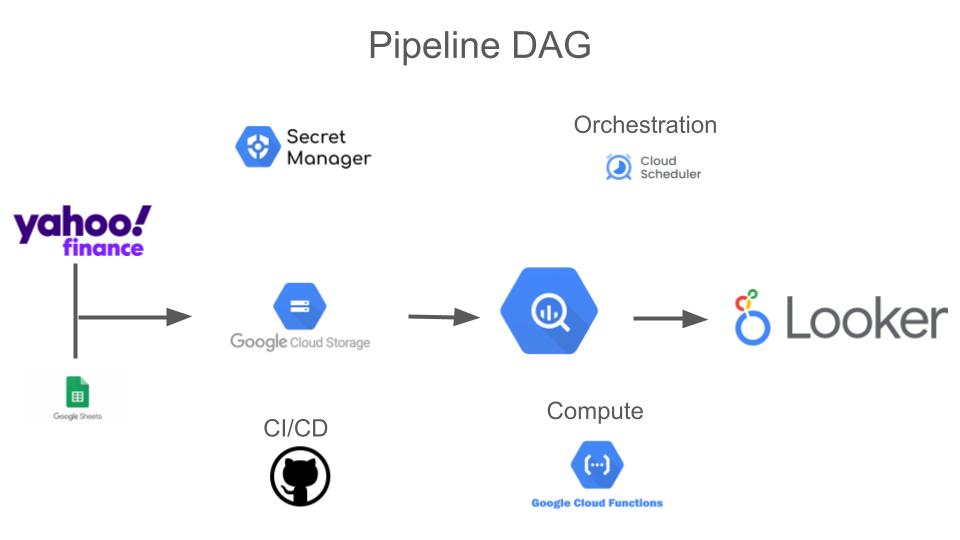
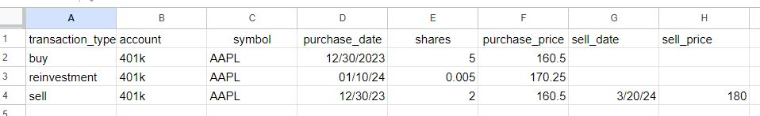
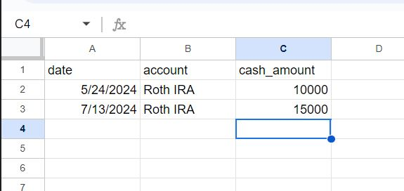
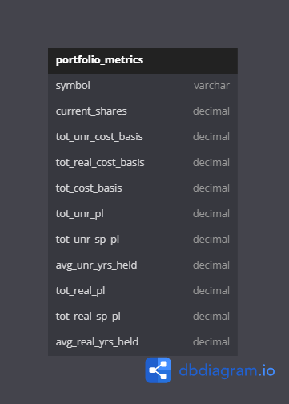

# Investment Portfolio ETL Pipeline 
This project aims to provide an ETL Pipeline for extracting investment portfolio data stored in Google Sheets, as well 
as financial data through Yahoo Finance, that can be deployed in GCP resulting in a Looker Dashboard to track portfolio performance.



## Initial Requirements
The following are needed in order to get setup and properly run this project

* Python >= Verion 3
  * IDE of choice
* Google Account
* Google Cloud Provider Account
* Google Sheet with two tabs containing portfolio data
  * One tab named 'Transactions' containing portfolio transaction history
  
  
  Currently, there are three options for transaction types (buy, sell, reinvestment), where reinvestment is an 
  automatic reinvestment of dividends into the holding it is paid out from.

  * One tab named 'Cash' for historical cash values in investment accounts
  

### Operating System
This project and directions are tailored towards a Linux operating system. It can be adjusted for windows or 
used through Windows Subsystem Linux.

## Setup

### Data Sources
There are two data sources that are required for extraction of the information needed.
* Google Sheet (Extracted through API)
  * History of trades, holdings, and cash levels
* Yahoo Finance (Extracted through API)
  * S&P 500 historical prices
  * Historical prices for current portfolio holdings from purchase date

A Google Account and Project must be created. [Here](https://developers.google.com/sheets/api/quickstart/python) is a link to 
Google's documentation for a Python quickstart with their Google Sheets API.

### GCP
This project is designed to be deployed through Google Cloud Provider using the following GCP services.

* Google Sheets API
* Secrets Manager
* Cloud Storage
* Cloud Functions
* BigQuery

To test and run locally, you'll also need the Google Cloud SDK and CLI installed locally. Once that is completed, perform the following steps to setup your GCP account.

1. Create a new project in your GCP account. 
2. Enable Google Sheets API
3. Enable Secrets Manager API
4. Create service account credential
    * Save JSON key as secret in Secrets Manager titled GCP_SERVICE_ACCOUNT_KEY
5. Create Cloud Storage bucket
    * Save name as secret in Secrets Manager titled BUCKET_NAME
6. Get Google Sheet ID from URL
    * Save ID as secret in Secrets Manager titled SPREADSHEET_ID
7. Log in to gcloud locally
    * From the terminal run the following command
```Bash
gcloud auth application-default login
```
8. 

### Data Storage Layers
* Google Cloud Storage
  - Raw storage of CSV files from initial data source extraction
    1. raw_cash.csv
    2. raw_prices.csv
    3. raw_transactions.csv
  - Clean storage of original raw files, saved as parquets to keep typing
    1. clean_cash.parquet
    2. clean_prices.parquet
    3. clean_transactions.parquet
* BigQuery
  - Staging dataset
  - Analytics dataset in desired data model with dimension and facts tables

### Portfolio Metrics View
After the database has been set up and the pipeline has been run, a view can be created using the 
`portfolio_view.sql` script for calculating portfolio metrics for returns and comparison versus 
the S&P 500. This script can be loaded into MySQL Workbench, the terminal, or any IDE connected 
to the database for execution.

Note that the example code in `portfolio_views.sql` is set up for analyzing one account at a time 
as noted in the WHERE clauses at lines 13, 19, and 118. Simply replace 'Roth IRA' with whichever 
name you denote for your account of interest. Or you can remove `account = 'Roth IRA' AND` from 
those lines entirely to analyze all accounts together.

The created view will result in the following columns.



### BI Tool
Once the view has been created, a BI tool such as Power BI can be connected to each of the three 
tables plus the view in the database. Then any time the pipeline is completed, a refresh of the 
data in the BI tool project can be executed. Additional calculated columns and measures can be 
creating using the BI tool project to build a report like the example found as `portfolio_report.pdf`.

## Future Iterations
More work can be done to improve the pipeline in the following ways.

* Incremental load of the data through the pipeline
* Use docker container for running project on any system locally or in the cloud with dependencies sorted
* Incorporate dividends not reinvested for portfolio and performance tracking
